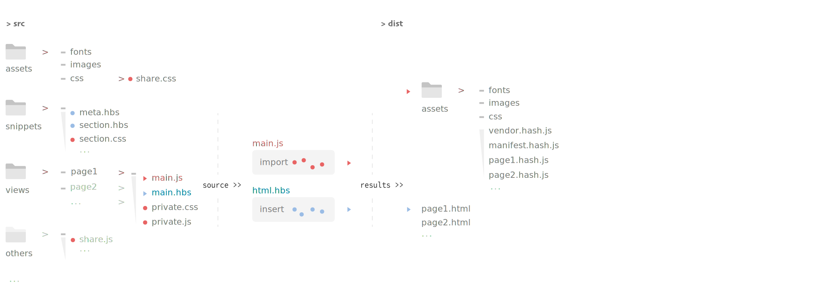

*"The study of the soul, that is to say the study of my own self."*


### Introduction

A **Multiple Entries Scaffold** for init a muti-pages project, depend on [webpack](https://webpack.js.org/) and it's loaders.

### Bundle Workflow



### Install
You may use **npm install** in the same way.
```
yarn install
```
### Usage

Developing use with hot reload
```
yarn run dev
```
Preproduction use with source map
```
yarn run pre 
```
Production use
```
yarn run build
```

### Configuration

The configuration object to handle webpack bundle result can find in **compiler** folder **config.js** file.
