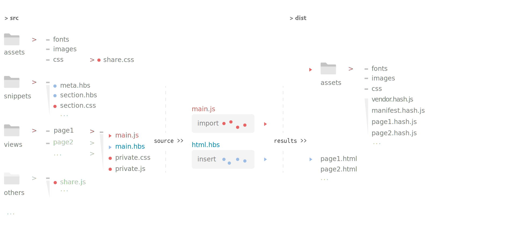

## Introduction
**KhovsgoL** is a multi page building scaffold based on [webpack](https://webpack.js.org/). The behavior of building process can be tweaked via various [configuration](./compiler/config.js) options.
###### Feature
- Share html snippets within pages
- Automatic find muti page entries and output share bundles
- Static libraries merged in bundling process
- Friendly error info output
- Es6, less, postcss, hbs support

The **Packing Structured** is figured as follows:


## How to 
Init a project with the following commands:
`$ yarn install`
Usage
- Developing use with hot reload
 `$ yarn run dev` 
- Preproduction use with source map
 `$ yarn run pre`
- Production use
 `$ yarn run build`

To custom the default building behavior, try to change the [configuration](./compiler/config.js) options in `/compiler/config.js`.


#### Html Snippet
Add snippet inside your template **html.hbs**
```
{{> section.hbs}} // will reference to "src/snippets/section.hbs"
```

#### External Libraries Import
The **externalsConifg.js** use for set webpack externals, while **meta.link-library.hbs** will insert in html.hbs file when compiling, all of them do not have to manually maintain by running: 
```
yarn run static
```

